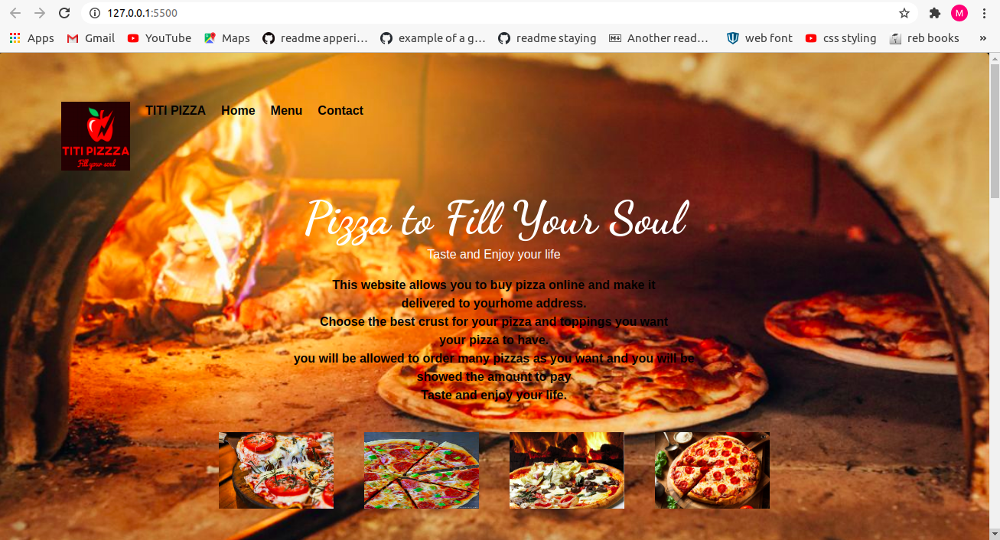

# TITI PZZA 
---
Here is the link to TITI pizza online shop: 
---

---
---
## PROJECT DISCRIPTION
---

This website allows a user to buy pizza online by shoosing the size of the pizza, crust of the pizza and the toppings he or she needs to be put on his or her pizza.
It allows allows a user to choose if he or she want her or his pizza to be delivered at his or her home address, if yes he will be allowed to fill address information and he or she will see the total amount to be paid.

## AUTHOR
---
MUGISHA THIERRY
A STUDENT FROM MORINGA SCHOOL RWANDA 
---
### SETUP
---
Fork this repository after clone this repository to go on your local git and after open it in your vscode and make same changes.
--- 
## BDD (Behaviour, Driven,Development)
---
ACTION  | OUTCOME|
|-------|--------|
|drop down to choose the size of your pizza  | You will be able to choose the pizza siz you want according to the price of the size.|
|Drop down and choose pizza crust| You will be able to see the available pizzza crust and pick one of your choice|
|select the pizza toppings you need to be put on your pizza | You eill be able to see a list of checkboxes where you will only check the toppings you want you pizza to have.|
|Enter the number of pizzas you want | here you are allowed to enter any number of pizzas you want|
|click the button "click here to see the amount to pay| you will see the amount to be paid for the pizza.|
|Choose if you want your pizza to be delivered at your home address| If you want your pizza to be delivered to your home address you will see a form to fill your address information where the pizza will be delivered.|
|Click checkout button| you will see the total amount to be paid for the pizza and delivery cost.|
|click ordernow button | this will bring a poping message thanking you for shooping with TITI pizza website|
|Click new order| this will remove all you entered values so that you can make a new order|
|fill the idea form| in case you have any problem or an advice you can put it in this form and include you names and email so that we can contact you|
|click submit| this will submit the form where you entered your idea|
|click on any contact icon| it will take you to the page where you can contact us.|
### TECHNOLOGY USED
---
- HTML
- CSS
- JAVASCRIPT
- Jquerry
- Bootstrap
- Object
- Constructors
---
### CONTACT INFORMATION
---
- INSTAGRAM: [mugisha_thierry_rwanda](https://www.instagram.com)
- FACEBOOK: [Mugisha Thierry](https://www.facebook.com)
- EMAIL: [thierrymugis@gmail.com](https://www.gmail.com)
---
#### COPY RIGHT AND LICENSE
---
MIT License

Copyright (c) 2019 John Mutavi

Permission is hereby granted, free of charge, to any person obtaining a copy
of this software and associated documentation files (the "Software"), to deal
in the Software without restriction, including without limitation the rights
to use, copy, modify, merge, publish, distribute, sublicense, and/or sell
copies of the Software, and to permit persons to whom the Software is
furnished to do so, subject to the following conditions:

The above copyright notice and this permission notice shall be included in all
copies or substantial portions of the Software.

THE SOFTWARE IS PROVIDED "AS IS", WITHOUT WARRANTY OF ANY KIND, EXPRESS OR
IMPLIED, INCLUDING BUT NOT LIMITED TO THE WARRANTIES OF MERCHANTABILITY,
FITNESS FOR A PARTICULAR PURPOSE AND NONINFRINGEMENT. IN NO EVENT SHALL THE
AUTHORS OR COPYRIGHT HOLDERS BE LIABLE FOR ANY CLAIM, DAMAGES OR OTHER
LIABILITY, WHETHER IN AN ACTION OF CONTRACT, TORT OR OTHERWISE, ARISING FROM,
OUT OF OR IN CONNECTION WITH THE SOFTWARE OR THE USE OR OTHER DEALINGS IN THE
SOFTWARE.
----